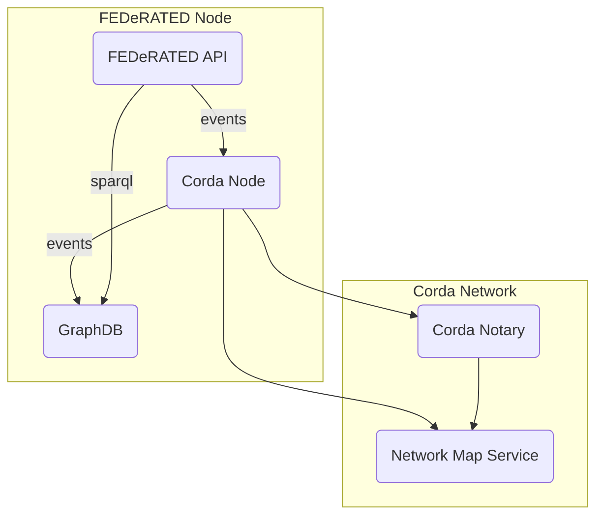
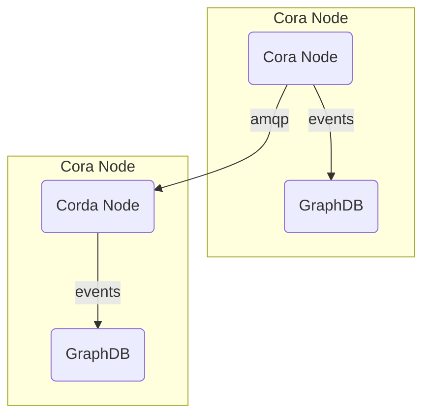

# FEDeRATED Node prototype

This repository contains the FEDeRATED Node prototype implementation.

## Components

A FEDeRATED Node is composed by the following components:

- FEDeRATED API
- Corda node
- GraphDB

It uses the following components from the Corda Network:

- Notary
- Network Map Service

As illustrated in the diagram below:



A FEDeRATED Node can distribute events to other nodes in the network, the Corda Node takes care of the distribution. Corda Nodes communicate peer-to-peer using AMQP.



## Event distribution

Events are distributed to other nodes based on the Nodes configuration. There are a few options how to configure the distribution mechanism:

* static: messages are routed to preconfigured destinations
* broadcast: messages are broadcast to all nodes in the network (based on the nodes in the Network Map Service).
* sparql: based on the outcome of a SPARQL ASK messages are routed to the provided destination(s).

### Static distribution

An example configuration of static distribution (see: application.properties):

```properties
# When there are no rules explicit rules enabled, the broadcast rule will be enabled by default
# Comma separated list of rules, rules defined here are executed in the order specified
bdi.event.distribution.rules.list=static

# Comma separated list of static destinations, all events will be sent to the locations specified here.
bdi.event.distribution.rules.static.destinations=DCA/Schiphol/NL
```
## API usage

A FEDeRATED Node can support any number of events. The API was designed in such a way that it can be configured what events
are supported and how incoming events should be converted the expected internal format of the FEDeRATED Node: RDF

There is an introspection API for the event configuration. The `/event-types` endpoint can be called to retrieve all the supported/configured
events of a node. The configuration includes:

* eventType: unique key for an event
* name: logical name of an event
* rml: RML mapping file for the conversion of an incoming JSON event to RDF
* shacl: SHACL shape for the validation of an incoming event

Example configuration (see: application.properties):

```properties
bdi.federated.event.types[0].eventType=federated.events.load-event.v1
bdi.federated.event.types[0].name=LoadEvent
bdi.federated.event.types[0].rml=classpath:rml/EventMapping.ttl
bdi.federated.event.types[0].shacl=classpath:shacl/LoadEvent.ttl
```

With an eventType a call to the `/events` endpoint can be made to submit new events.
The body of the request should contain the JSON data describing the event. The `Event-Type` request header defines the incoming event type.

An example request:

```bash
curl -X 'POST' \
  'http://localhost:10050/events' \
  -H 'accept: */*' \
  -H 'Event-Type: federated.events.load-event.v1' \
  -H 'Content-Type: application/json' \
  -d '{ "event" : "data" }'

```

For more info also refer to the Swagger page: http://localhost:10050/swagger-ui/index.html

## How this project is organized

| module                                | description                                                                     |
|---------------------------------------|---------------------------------------------------------------------------------|
| [api](api/)                           | FEDeRATED API application that exposes endpoints for interacting with the node  | 
| [corda](corda/)                       | Contains the corda specific functionality (workflows, contracts, cordformation) | 
| [docs](docs/)                         | Technical documentation                                                         |
| [graphdb](graphdb/)                   | GraphDB repository configuration for bdi and private repositories               |
| [http](http/)                         | Example HTTP requests demonstrating how to invoke the API application           |
| [ishare](ishare/)                     | iSHARE specific integration code                                                | 

## Documentation

Technical documentation [can be found here](docs/README.md).

## Changelog

Please refer to the [changelog](CHANGELOG.md).

## License

Project [license](LICENSE.md).   
