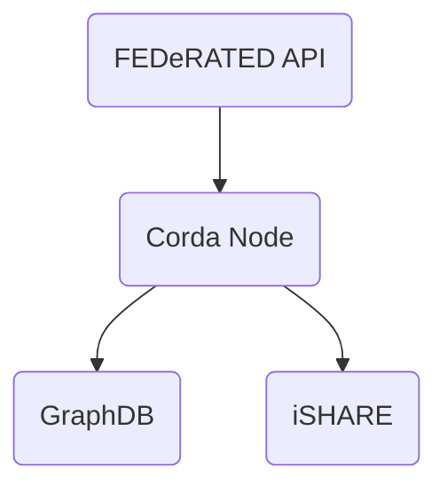

# FEDeRATED BDI prototype

This repository contains the FEDeRATED Node prototype implementation.

## Components

A FEDeRATED Node is composed by the following components:

- FEDeRATED API
- Corda node
- GraphDB

### Diagram

## How this project is organized

| module                                | description                                                                     |
|---------------------------------------|---------------------------------------------------------------------------------|
| [api](api/)                           | FEDeRATED API application that exposes endpoints for interacting with the node  | 
| [corda](corda/)                       | Contains the corda specific functionality (workflows, contracts, cordformation) | 
| [docs](docs/)                         | Technical documentation                                                         |
| [graphdb](graphdb/)                   | GraphDB repository configuration for bdi and private repositories               |
| [http](http/)                         | Example HTTP requests demonstrating how to invoke the API application           |
| [ishare](ishare/)                     | iSHARE specific integration code                                                | 

## Documentation

Technical documentation [can be found here](docs/README.md).

## Changelog

Please refer to the [changelog](CHANGELOG.md).

## License

Project [license](LICENSE.md).   
