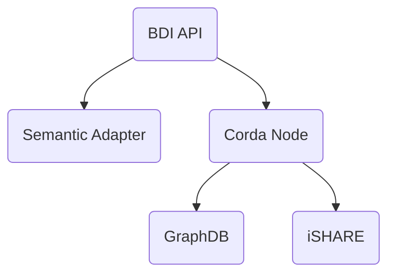

# FEDeRATED BDI prototype

This repository contains the FEDeRATED BDI prototype implementation.

## Components

A BDI node is composed by the following components:

- BDI API
- Corda node
- GraphDB
- Semantic Adapter

### Diagram

## How this project is organized

| module                                | description                                                                           |
|---------------------------------------|---------------------------------------------------------------------------------------|
| [api](api/)                           | BDI API application that exposes endpoints for interacting with the node              | 
| [corda](corda/)                       | Contains the corda specific functionality (workflows, contracts, cordformation)       | 
| [docs](docs/)                         | Technical documentation                                                               |
| [graphdb](graphdb/)                   | GraphDB repository configuration for bdi and private repositories                     |
| [http](http/)                         | Example HTTP requests demonstrating how to invoke the API application                 |
| [ishare](ishare/)                     | iSHARE specific integration code                                                      | 
| [semantic-adapter](semantic-adapter/) | Semantic Adapter takes care of converting (JSON) data to triples (RDF turtle format)  | 

## Documentation

Technical documentation [can be found here](docs/README.md).

## Changelog

Please refer to the [changelog](CHANGELOG.md).

## License

Project [license](LICENSE.md).   
