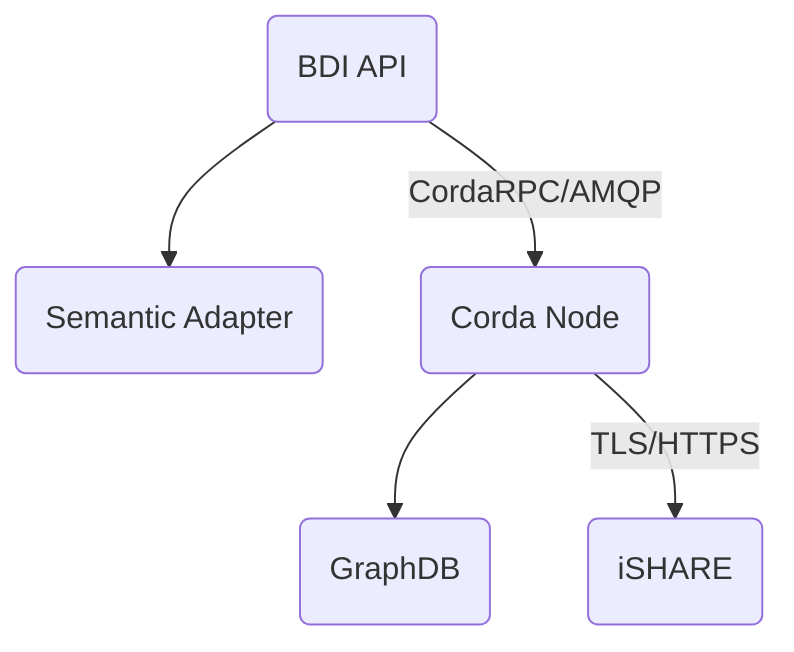

# FEDeRATED BDI prototype technical documentation

This document contains the technical documentation for the FEDeRATED BDI prototype.

## Components

A BDI node is composed by the following components:

- Corda node
- BDI API (includes the semantic adapter)
- GraphDB

### Diagram

### Documentation 

All the individual components are described in the following pages:

| module                                    | description                                               |
|-------------------------------------------|-----------------------------------------------------------|
| [BDI API](api.md)                         | BDI API documentation                                     | 
| [Corda](corda.md)                         | Corda documentation (workflows, contracts, cordformation) | 
| [iSHARE](ishare.md)                       | iSHARE documentation                                      | 
| [Semantic Adapter](semantic-adapter.md)   | Semantic adapter documentation                            | 
| [GraphDB](graphdb.md)                     | GraphDB setup guide                                       | 
| [Development guide](development-guide.md) | Development environment setup guide                       | 

### Running using Docker

The is also a Dockerized setup available on github, please refer to: https://github.com/Federated-BDI/Docker-BDI-Node

