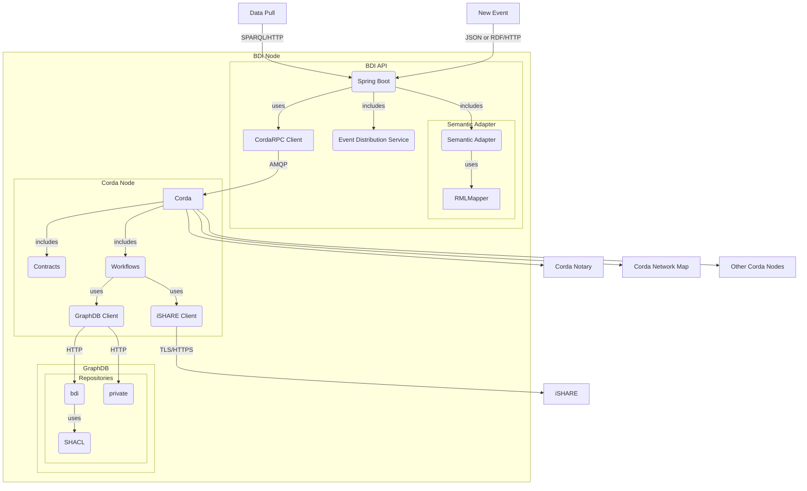

# FEDeRATED BDI prototype technical documentation

This document contains the technical documentation for the FEDeRATED BDI prototype.

## Components

## Technical documentation

The following documentation is available:

| Component                                 | Description                                               |
|-------------------------------------------|-----------------------------------------------------------|
| [API](api.md)                             | BDI API documentation                                     | 
| [Corda](corda.md)                         | Corda documentation (workflows, contracts, cordformation) | 
| [Development Guide](development-guide.md) | Development environment setup guide                       | 
| [GraphDB](graphdb.md)                     | GraphDB setup guide                                       | 
| [iSHARE](ishare.md)                       | iSHARE documentation                                      | 
| [Security](security.md)                   | Security consideration                                    | 
| [Semantic Adapter](semantic-adapter.md)   | Semantic adapter documentation                            |
| [Testing](testing.md)                     | Unit and integration testing documentation                | 

### Running using Docker

The is also a Dockerized setup available on github, please refer to: https://github.com/Federated-BDI/Docker-BDI-Node

