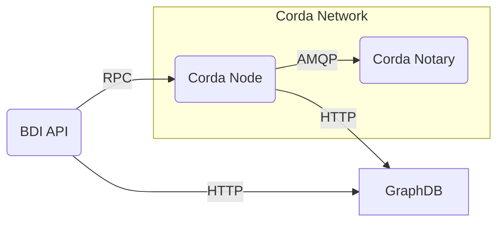
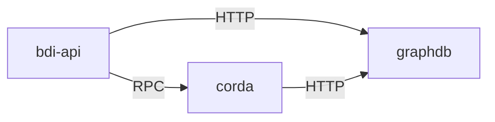

## Deployment of a BDI Node

A BDI node consists of the following components:

* GraphDB: triple store
* BDI API: standalone Java application, packaged as an executable jar
* Corda node: corda + cordapps

### Corda network

The cordapps require the presence of at least one Notary in the Corda network.

### Deployment diagram

#### Components

#### Containers

The docker based deployment consists of at least 3 containers per BDI node. 

* 'khaller/graphdb-free:10.0.0' 
  * exposed port: 7200
* bdi-api
  * exposed port: 10050
* corda
  * exposed port: 10006

### Onboarding

A node in the Corda network needs to be onboarded by the Corda doorman.

