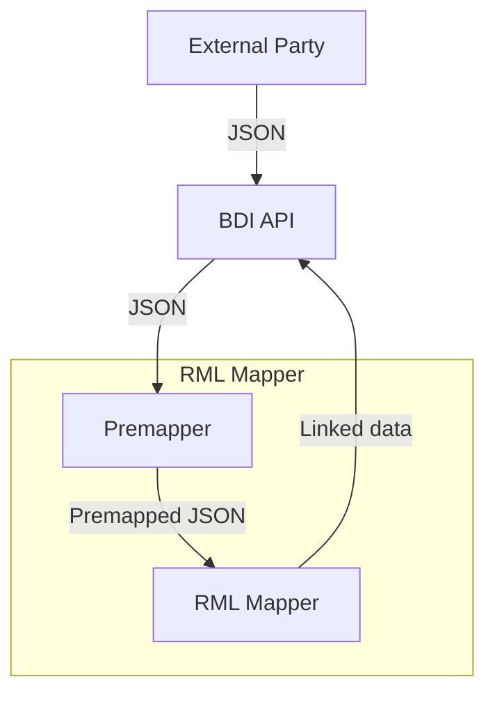

# RMLMapper

Semantic Adapter uses the RMLMapper library: https://github.com/RMLio/rmlmapper-java The RMLMapper executes RML rules to generate Linked Data. It is a Java library, which is available via the command line but can also be integrated into a JVM based application.

## YARRRML

The resources folder contains both ttl and yml files. The yml files or a more concise way of defining the mapping files and can be used to generate the ttl files with: https://rml.io/yarrrml/matey/

# RML Mapping

The architecture is described in the flowchart below. The BDI node receives JSON data from the API, which is passed to the RML Mapper. It is first converted to a different JSON format (premapping) and then passed to the RML Mapper, which generates linked data in Turtle format. This linked data forms the response to the request from the BDI node.

