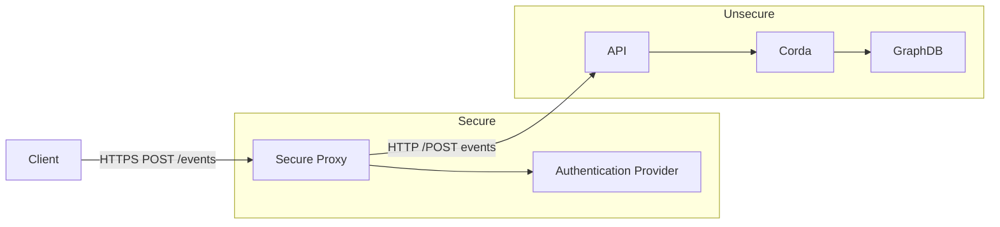
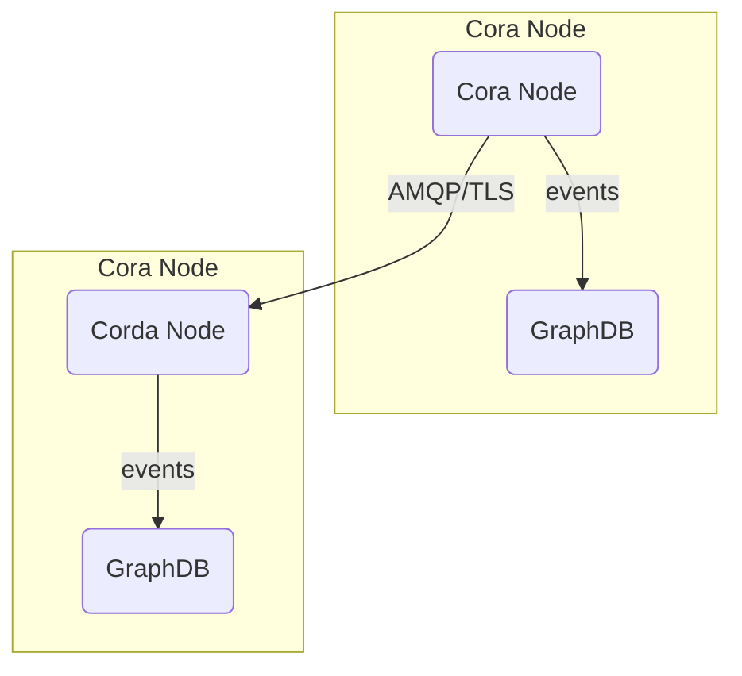

# Security

## API security consideration

The FEDeRATED Node API endpoints are out of the box not secured, however we strongly recommend to secure the API endpoints
using transport layer security and an authentication and/or authorisation mechanism for the API. 

Reason for not embedding an authentication and/or authorisation mechanism for the API is because most parties already 
have existing authentication mechanisms in place like a secure proxy or API gateway.

## TLS

### API endpoints

For production environment it's highly recommended to use transport layer security (HTTPS) for accessing the API endpoints. One could use https://letsencrypt.org/ or any other certificate authority for generating certificates.

### Corda nodes

Corda nodes communicate peer-to-peer. Communication using AMQP over TLS can be configured when needed. Please refer to the Corda documentation for more information: https://docs.r3.com/en/platform/corda/4.9/enterprise/node/component-topology.html#node-communication-protocols

## Corda Network admission

Corda nodes follow a specific protocol for the onboarding and admission to a Corda 'network'. In short, nodes need to follow a (one-time) registration
process before they are allowed to join a 'network', this can be customized for specific use-cases. For more in depth information please refer to the Corda documentation for more details:

* https://docs.r3.com/en/platform/corda/4.10/community/compatibility-zones.html
* https://docs.r3.com/en/platform/corda/4.10/community/setting-up-a-dynamic-compatibility-zone.html
* https://docs.r3.com/en/platform/corda/4.10/community/business-network-membership.html

## iSHARE

This prototype contains an implementation for iSHARE to secure the node to node communication. This is disabled by default but can be enabled through configuration, please refer to the [iSHARE documentation](ishare.md).