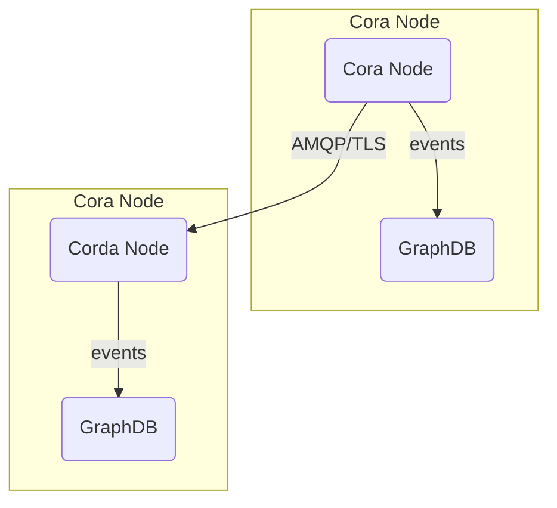

# Security

## FEDeRATED Node Security

There are two security concerns that need attention. First is the API endpoints that are exposed by the FEDeRATED Node API. 
Second is the event distribution communication between nodes.

API endpoints (/api/**) are out of the box secured using Basic authentication, note that this is **not recommended** for production environments!
The current implementation is based on [Spring Security](https://spring.io/projects/spring-security).
Whenever API endpoint security is enabled the API consumer is required to provide a base64 encrypted username:password combination in the Authorization: Basic request header.
The built-in security mechanism provides a role-based authentication configuration. 

When using an external authentication mechanism, like an API gateway, then one might want to disable the provided authentication mechanism. This can be
done using the configuration of the Node API. In the `application.properties` the following properties can be altered to modify the security configuration of a node.

```properties
# Enable or disable the api security feature, default=true
federated.node.api.security.enabled=true
# API username, default value=api
federated.node.api.security.username=api
# API password encrypted using bcrypt, default value=password
federated.node.api.security.password=$2a$04$QSdb8yrtXowsJMBf/.Nkku/85wceyamR4LPArNCwE264bXtATef8m
```

optional a seperate user can be defined for the webhook API. If this is not used the above username is used for the webhook API

```properties
# API username, default value=webhook
federated.node.api.security.webhook.username=webhook
# API password encrypted using bcrypt, default value=password
federated.node.api.security.webhook.password=$2a$04$QSdb8yrtXowsJMBf/.Nkku/85wceyamR4LPArNCwE264bXtATef8m
```

## TLS

### Node API endpoints

For production environment it's highly recommended to use transport layer security (HTTPS) for accessing the API endpoints. One could use https://letsencrypt.org/ or any other certificate authority for generating certificates.

### Event Distribution / Communication between Corda nodes

Corda nodes communicate peer-to-peer. Corda 4.x uses AMQP. AMQP over TLS can be configured whenever needed. Please refer to the Corda documentation for more information: https://docs.r3.com/en/platform/corda/4.9/enterprise/node/component-topology.html#node-communication-protocols



## Corda Network admission

Corda nodes follow a specific protocol for the onboarding and admission to a Corda 'network'. In short, nodes need to follow a (one-time) registration
process before they are allowed to join a 'network', this can be customized for specific use-cases. For more in depth information please refer to the Corda documentation for more details:

* https://docs.r3.com/en/platform/corda/4.10/community/compatibility-zones.html
* https://docs.r3.com/en/platform/corda/4.10/community/setting-up-a-dynamic-compatibility-zone.html
* https://docs.r3.com/en/platform/corda/4.10/community/business-network-membership.html

## iSHARE

This prototype contains an implementation for iSHARE to secure the node to node communication. This is disabled by default but can be enabled through configuration, please refer to the [iSHARE documentation](ishare.md).