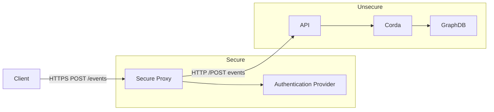
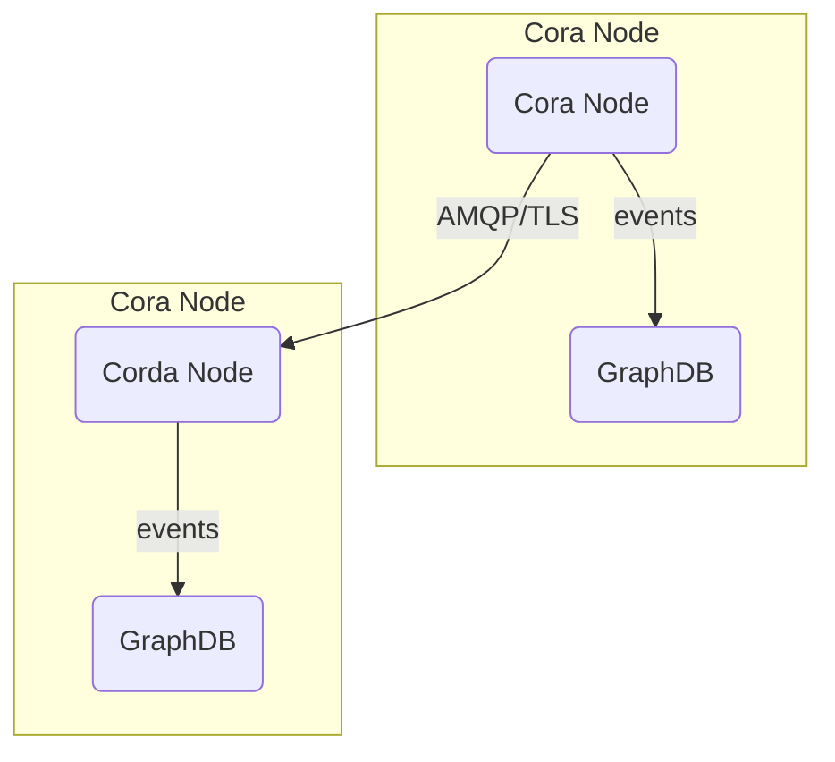

# Security

## FEDeRATED node security consideration

FEDeRATED node API endpoints (/api/**) are out of the box secured using (Spring Security)[https://spring.io/projects/spring-security]. Basic authentication is
implemented for the api endpoints, this is not recommended for production environments! We also strongly recommend to 
 secure the API endpoints using transport layer security (TLS). Security can be disabled complete in favor of an API 
gateway or any other existing authentication mechanisms.

In the `application.properties` the following properties can be set to modify the security configuration of a node.

```properties
# Enable or disable the api security feature, default=true
federated.node.api.security.enabled=true
# API username, default=api
federated.node.api.security.username=api
# API password encrypted using bcrypt, default=password
federated.node.api.security.password=$2a$04$QSdb8yrtXowsJMBf/.Nkku/85wceyamR4LPArNCwE264bXtATef8m
```

API to Corda communication is by default non-secure on the transport
layer. This can be secured usin TLS. 



## TLS

### API endpoints

For production environment it's highly recommended to use transport layer security (HTTPS) for accessing the API endpoints. One could use https://letsencrypt.org/ or any other certificate authority for generating certificates.

### Corda nodes

Corda nodes communicate peer-to-peer. Communication using AMQP over TLS can be configured when needed. Please refer to the Corda documentation for more information: https://docs.r3.com/en/platform/corda/4.9/enterprise/node/component-topology.html#node-communication-protocols




## Corda Network admission

Corda nodes follow a specific protocol for the onboarding and admission to a Corda 'network'. In short, nodes need to follow a (one-time) registration
process before they are allowed to join a 'network', this can be customized for specific use-cases. For more in depth information please refer to the Corda documentation for more details:

* https://docs.r3.com/en/platform/corda/4.10/community/compatibility-zones.html
* https://docs.r3.com/en/platform/corda/4.10/community/setting-up-a-dynamic-compatibility-zone.html
* https://docs.r3.com/en/platform/corda/4.10/community/business-network-membership.html

## iSHARE

This prototype contains an implementation for iSHARE to secure the node to node communication. This is disabled by default but can be enabled through configuration, please refer to the [iSHARE documentation](ishare.md).