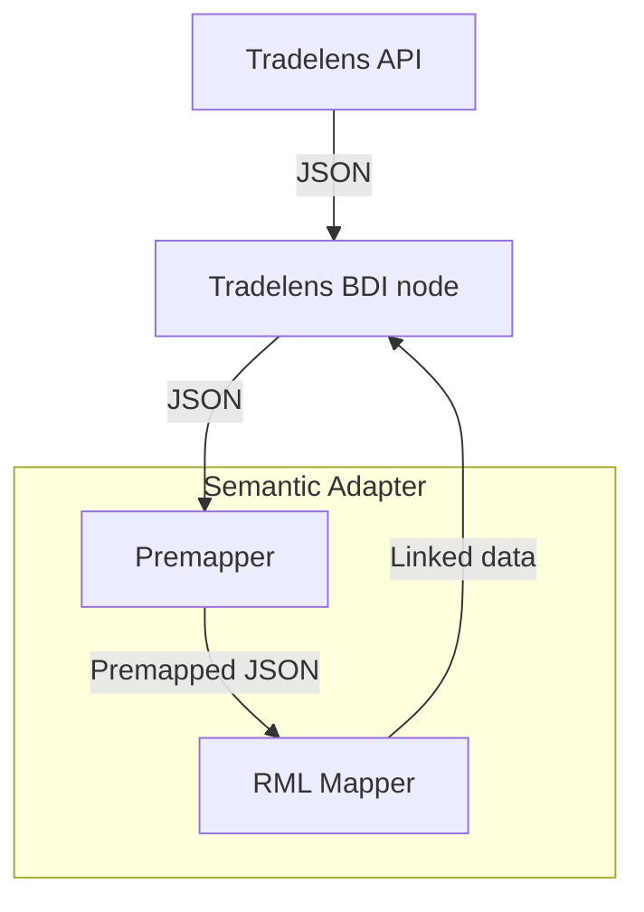

# Semantic Adapter 

The semantic adapter application is an application that demonstrates how to convert non-semantic data to a semantic format like RDF/turtle. It provides an implementation for the Tradelens use-case.

This application was written in Kotlin and designed in such a way that it can be integrated into any JVM (Java/Kotlin/etc) based application. Being a Spring Boot application, it can be also be used as a standalone Microservice that can be accessed over HTTP. 

# Run the application as a standalone Microservice

Start the application running the following command:

```
./gradlew bootRun
```

Once the application was started it can be accessed via the following URL: http://localhost:8080/swagger-ui/

## Available endpoints

The standalone application exposes following two endpoints:

- /tradelens/events: accepts Tradelens JSON events data (like "Actual Vessel Loaded"). When a successful conversion can be made, it will return RDF/Turtle.
- /tradelens/containers accepts Tradelens JSON container data (like "TransportEquipmentList"). When a successful conversion can be made, it will return RDF/Turtle.

## Configuration

Since this application is a Spring Boot application, the default settings can be overridden. See for example this article: https://www.baeldung.com/spring-boot-change-port 

# RDLMapper

Semantic Adapter uses the RMLMapper library: https://github.com/RMLio/rmlmapper-java The RMLMapper executes RML rules to generate Linked Data. It is a Java library, which is available via the command line but can also be integrated into a JVM based application.

## YARRRML

The resources folder contains both ttl and yml files. The yml files or a more concise way of defining the mapping files and can be used to generate the ttl files with: https://rml.io/yarrrml/matey/

# Organisation of files in this repository

| Path                                                        | Description                                        |
|-------------------------------------------------------------|----------------------------------------------------|
| src/main/kotlin/nl/tno/federated/semantic/adapter/core      | Core funtionality, internally using the RML mapper. | 
| src/main/kotlin/tradelens                                   | Tradelens specific mapping code.                   | 
| src/main/resources/tradelens                                | Tradelens specific mapping rule files.             | 
| src/test/kotlin/nl/tno/federated/semantic/adapter/tradelens | Tests verifying that the Tradelens use-case works. |   

# Running the Dockerized version of the Semantic Adapter

First build the Spring Boot jar by executing the following command in the root directory of this repository.

```
./gradlew bootJar
```

Next build the Docker image.


```
docker build semantic-adapter
```

And run the Docker image.

```
docker run .
```

The image should now run and is accessible at port 8080.

# Architecture

The architecture is described in the flowchart below. The Tradelens BDI node receives JSON data from the API, which is passed to the Semantic Adapter. It is first converted to a different JSON format (premapping) and then passed to the RML Mapper, which generates linked data in Turtle format. This linked data forms the response to the request from the BDI node.

